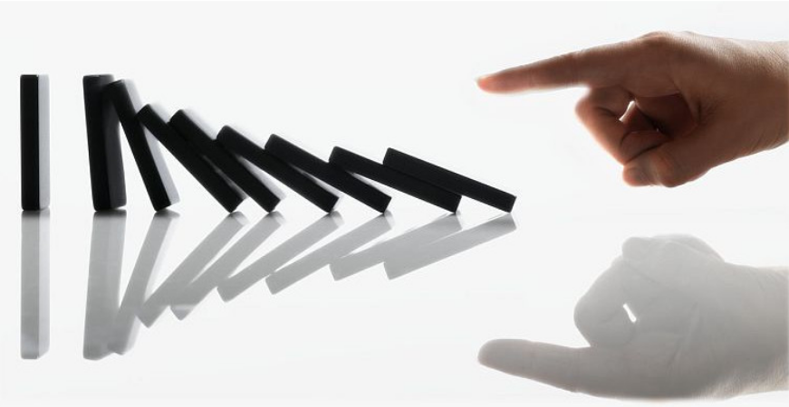
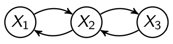
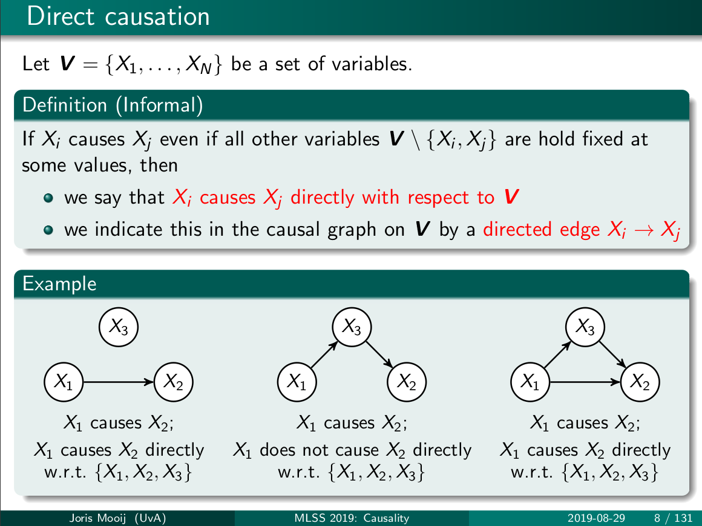
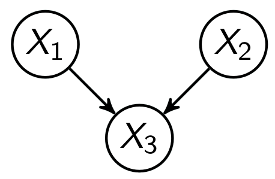
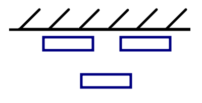

# Каузация

# Correlation does not imply causation!

(ниже используются неклассические определения)

***Каузация*** - она же **причинность**, она же **обусловленность**. Термин с помощью которого обозначают необходимую связь между двумя событиями цепочкой **причина** → **следствие**.

***Корреляция*** - **взаимосвязь** двух событий, как правило, под ней подразумевают статистическую взаимосвязь событий. При этом, ограничение на "необходимость" снимается, подчеркивая тем самым, что два события могут быть скоррелированы, но не иметь отношения **причина** → **следствие**.

Корреляционный анализ различных событий является широко используемым в науке (бизнесе, инженерии и др.) инструментом для установления взаимосвязи между явлениями. Там, где возникает видимость взаимосвязи между событиями появляется соблазн установить между ними причинно-следственную связь, что является типичной ошибкой в науке.

- [Пример](https://wikiboard.ru/wiki/Correlation_does_not_imply_causation#Examples_of_illogically_inferring_causation_from_correlation) ошибочного вывода каузации из корреляции

    По мере роста продаж мороженого количество смертей от утопления резко возрастает.
    Следовательно, потребление мороженого вызывает утопление. 

Какого же отношение между корреляцией и каузацией? Для ответа на этот вопрос проще всего сначала рассмотреть отношение между каузацией и истиной. Вспоминая основную аксиому истины, а именно что: "**Абсолютной истины - нет.**" - мы без труда способны заключить, что назначить абсолютную причинно-следственную связь между двумя событиями значит нарушить эту аксиому. Но истина является безусловно более общим понятием по отношению к каузации. Поэтому нам придётся либо (1) разработать определённую логику в назначении каузации, либо (2) вовсе отказаться от этого понятия, упиваясь только сомнительной корреляцией.

Многие **те**, кто мнят себя агностиками выбрали бы второй вариант: утверждать, что мы не можем установить истинную причинно-следственную связь между событиями - утверждать, что каузация - *непознаваема*. В их абсолютизирующем пессимизме им глупо отказывать, но ещё более глупо не признавать тот факт из объективной действительности, что какие-то каузации нам, по-видимому, таки удаётся установить. Речь идёт, конечно, о немногочисленных физических законах, которые нам удалось установить и которые составляют пожалуй основу нашего технического прогресса сегодня.

Таким образом, далее эта статья будет посвящена тем, кто избрал первый путь в постижении каузации. К счастью, теория истины благоволит тем, кто выбрал эту дорогу, предлагая несколько общих соображений (критериев) по тому, как (практически, и к этому мы ещё вернёмся) безошибочно устанавливать каузальную связь между событиями. 

# Необходимые критерии каузального вывода

Первым и наиболее наглядным из таких соображений является **последовательность**. Здесь прошу заметить, что ни в определении корреляции ни в определении каузации не говорится о  последовательности событий во времени. Наилучшим объяснением этого является тот факт, что мы в действительности не знаем влияют ли события настоящего на прошлое, поскольку мы не можем (хотя это неочевидно) поставить прямой эксперимент показывающий такой эффект. Ибо все известные на сегодняшний день эксперименты планируются исходя из часто неявного предположения о **прямом** течении времени. С другой стороны, те каузации, которые нам уже удалось установить прекрасно объясняются в рамках прямого течения времени. Таким образом, несмотря на кажущуюся самоочевидность этого критерия каузальности, следует держать его в голове. В особенности, когда вы работаете на очень малых (микросекунды) или очень больших масштабах времени (годы), интуитивно чуждых человеческому мышлению.

- Пример нарушения критерия последовательности при каузальном выводе

    Во время продолжающейся грозы, вы обратили внимание на звук грома, за которым через несколько секунд последовал грозовой разряд с характерной вспышкой света. Вы можете ошибочно предположить, что гром является предшественником молнии, как бы упреждая о ней. Однако, гром является именно **следствием** возникшего разряда, создавшего звуковую волну, но из за разницы скоростей света и звука, вы можете перепутать причину и следствие.

Вторым соображением является **когерентность**, означающая, что устанавливать причинно-следственные связи между вновь наблюдаемыми событиями вы должны в рамках некоторой когерентной системы, например, в рамках системы законов механики, которые были достоверно установлены ранее. При этом когерентность здесь можно упрощённо понимать как **непротиворечивость** сложившейся системе убеждений.

- Пример когерентного вывода

    Вы замечаете, что каждый раз когда бьёте ногой по мячу, раскручивая его, мяч отклоняется в сторону от прямой траектории удара ([эффект Магнуса](https://ru.wikipedia.org/wiki/%D0%AD%D1%84%D1%84%D0%B5%D0%BA%D1%82_%D0%9C%D0%B0%D0%B3%D0%BD%D1%83%D1%81%D0%B0)). Если вы не знакомы с когерентной системой **гидродинамика** и соответствующим эффектом, объясняющим это наблюдение, то вы рискуете истолковать увиденное в рамках некогерентных никакой системе догадок, вроде: "когда я закручиваю мяч, он понимает меня - понимает куда я хочу ударить!".

К сожалению, когерентность может сыграть с вами злую шутку, в случае если вы исследуете взаимосвязь между событиями, для которых модель системы является плохо определённой (как это часто происходит с некоторыми психологическими теориями). Другими словами, когда вы пытаетесь сделать научное открытие в слабо исследованной области. В этом случае вам следует обратиться к третьему соображению.

Третьим соображением является пресловутая **конвенция**. Этот критерий является наиболее универсальным, поскольку отсылает нас непосредственно к теории конвенциональной истины, которая постулирует конвенцию как единственный источник истинности некоторого утверждения. В нашем случае в качестве такого утверждения выступает высказывание о существовании причинно-следственной взаимосвязи между событиями. 

Четвертым соображением выступает хорошо знакомая всем **корреляция**. Истинная каузация всегда сопровождается корреляцией. Обратное не верно, и здесь стоит пояснить, что для любых двух коррелированных событий, **A** и **B**, их возможные отношения включают [[источник](https://wikiboard.ru/wiki/Correlation_does_not_imply_causation)]:

- A вызывает B (прямая причинная связь);
- B вызывает A (обратная причинность);
- A и B являются оба вызваны C
- A вызывает B, а B вызывает A (двунаправленная или циклическая причинность);
- Нет связи между A и B; корреляция является совпадением.

Иными словами, нельзя сделать вывод о существовании или направлении причинно-следственной связи только на основании того факта, что А и В коррелированы.

Стоит, однако, понимать, что приведенные выше критерии являются **необходимыми**, но **не** **достаточными** для установления каузации. О них мы поговорим ниже.

# Простые модели каузального вывода

Простые модели порой порождают богатые следствия. Ниже речь пойдёт о модели каузального вывода за авторством [Joris Mooij](https://staff.fnwi.uva.nl/j.m.mooij/), которую можно счесть остроумной и достаточно чётко формулирующей **достаточные** критерии каузации. Пожалуй, проще всего объяснить положения этой модели используя графовые представления. Но также, для простоты, эти модели будут снабжены примерами на игральных костяшках домино. Наверняка все мы видели как выстроенные в ряд костяшки домино, вызывают падение друг друга, при толчке одной из них - весьма наглядная иллюстрация причины и следствия.

haha classic

Итак, наши рассуждения начинаются с формирования модели. Её формирование обычно происходит в нашей голове, как правило, автоматически, но иногда требует серьёзных умственных усилий. Для примера мы возьмём те же кости домино, выстраивая их в ряд. Допустим мы выстроили в ряд 3 доминошки расположив их на ровной поверхности в непроветриваемом помещении. Так что никакие факторы, **по нашему мнению**, не способны вызвать цепную реакцию падения, за исключением нашего непосредственного толчка. В момент, когда вы закончили выставлять доминошки, в вашей голове вероятно созрела модель системы "доминошки выставленные в ряд". Вы много раз видели как работает такая система и можете достаточно уверенно воспроизводить её образ. Более того благодаря этому априорному знанию, вы знали на каком расстоянии ставить костяшки друг от друга, чтобы цепная реакция была возможна. Это пример хорошо определённой модели системы и, к сожалению, таких систем нам известно крайне немного. Давайте формализуем то что мы только что сделали.

Давайте выразим наши костяшки домино в качестве некоторых случайных величин $X_1, X_2, X_3$. Случайная величина $X$ может находится в двух состояниях: *стоит* и *падает*. Мы также подчеркнём тот факт, что наша полная каузальная модель, назовём её $V$, состоит только из этих трёх объектов, то есть $V=\{X_1, X_2, X_3\}$, иными словами в рамках модели этой системы для нас **не** существует никаких иных факторов, способных повлиять на костяшки домино или оказаться под их влиянием. Для упрощения представления, мы можем изобразить графически нашу модель, как на рисунке ниже.

Каузальная модель системы из трёх доминошек

Стрелочками на рисунке мы обозначаем наличие каузальной связи между костяшками, вкладывая в них тот смысл, что *падение* из костяшек способно вызывать падение соседней (то есть $X_1$  не может напрямую влиять на $X_3$). Теперь мы наконец можем сформулировать **достаточно условие** каузального вывода:

Если $X_i$ обусловливает $X_j$ даже если все остальные величины модели $V\setminus\{X_i, X_j\}$*зафиксированы* в некоторых состояниях, то $X_i$ обусловливает $X_j$ в соответствии с моделью $V$.

- Слайд с оригинальной формулировкой определения

    

Иными словами, если мы зафиксируем все факторы в нашей каузальной модели и пронаблюдаем взаимодействие только пары из них, то в случае наблюдения корреляции между ними, мы можем сделать вывод о наличии каузации с **учётом модели** $V$.

Для того чтобы продемонстрировать адекватность достаточного условия приведём ещё один пример с домино. Представим, что мы помещаем две доминошки $X_1$, $X_2$ возле стены, которая подпирает их с одной стороны и не даёт им упасть. Третью $X_3$ доминошку располагаем перед ними (см. рисунок).

Каузальная модель доминошек

Расположение доминошек (вид сверху) черными линиями показана стена.

Каузальная модель этой системы будет выглядеть так как представлено на графе, первая и вторая способны влиять на третью, но не наоборот, а также первая и вторая не способны влиять друг на друга (в этой модели мы исключаем толчок костяшки за малую грань). Теперь толкнём костяшку $X_1$ и видим, как её падение приводит к падению $X_3$, при этом $X_2$ остаётся стоять. То что мы увидели, есть ничто иное как корреляция, а именно, что падение **первой**, по видимому, как-то взаимосвязано с падением **третьей**, но можем ли мы быть уверены, что на падение **третьей** на самом деле не повлияла **вторая**? Для того чтобы убедиться в том, что наша корреляция действительно порождает каузацию, воспользуемся необходимыми и достаточными условиями, приведёнными в этой статье. Ниже приводится примерный порядок рассуждений:

1. События протекают в прямом времени, то есть возникают последовательно - действительно падение второй костяшки произошло после падения первой.
2. События не противоречат когерентной системе (законам механики), в данном случае передача взаимодействия происходит в соответствии с законом сохранения импульса, а ускорение при падении в соответствии с законом всемирного тяготения (здесь нам достаточно Ньютоновской интерпретации).
3. По поводу наблюдаемых событий определённо существует конвенция между людьми, если вы предложите своему другу проделать аналогичный опыт, он скорее всего не откажет вам в наличии каузальной связи между $X_1$ и $X_3$, если конечно не решит слукавить (от чего, конечно, в такой ситуации трудно воздержаться).
4. Между событиями наблюдается корреляция - это мы уже установили ранее, но не мешает повторить.
5. Взаимосвязь между $X_1$ и $X_3$ наблюдалась при фиксированной $X_2$, что позволяет нам сделать вывод о каузации с **учётом модели** $**V**$.

Итак, пройдя вышеперечисленные шаги (в чём-то даже избыточные), мы действительно приходим к тому, что наблюдаемая корреляция между $X_1$ и $X_3$ на самом деле является каузацией. Но как вы уже наверняка заметили, мы постоянно носим за собой "детального дьявола" под названием "**с учётом модели** $***V***$". В заключение, рассмотрим его поближе.

# Ограничения модели

Какие бы достаточные условия каузации вы не повстречали (а их, намного больше, нежели одно приведённое в этой статье), эти условия всегда будут исходить из некоторого образа реальной физической системы, которую вы себе вообразили. Другими словами, настолько верны будут критерии каузации, насколько наиболее полную модель системы вы в состоянии вообразить. В примере с 3-мя доминошками сложно слишком уж сильно ошибиться в моделировании, как и было сказано выше: оно возникает автоматически. С другой стороны, когда вы имеете дело с 3-мя миллионами домино, определённые трудности могут вас поджидать, например придётся учитывать вес отдельной костяшки, скорость ветра (если вы не в помещении) или даже влажность воздуха, для того чтобы точно предсказать поведение такой системы. В более сложных системах, вдохновлённых природой, биологических, космологических или, вдохновленных инженерией, технических системах по настоящему сложно бывает установить причинно-следственные связи между событиями. Здесь нам на помощь приходит статистика и компьютерное моделирование, но зачастую помогает и **простое человеческое размышление**.

С вами был каузально вдохновлённый *ДОК, 29.07.2021*

- Дополнительные ссылки для чтения

    [https://wikiboard.ru/wiki/Correlation_does_not_imply_causation#Examples_of_illogically_inferring_causation_from_correlation](https://wikiboard.ru/wiki/Correlation_does_not_imply_causation#Examples_of_illogically_inferring_causation_from_correlation)

    [https://wikiboard.ru/wiki/Granger_causality](https://wikiboard.ru/wiki/Granger_causality)

    [https://github.com/mlss-skoltech/lectures/blob/master/causality/mlss_causality_v2.pdf](https://github.com/mlss-skoltech/lectures/blob/master/causality/mlss_causality_v2.pdf)
